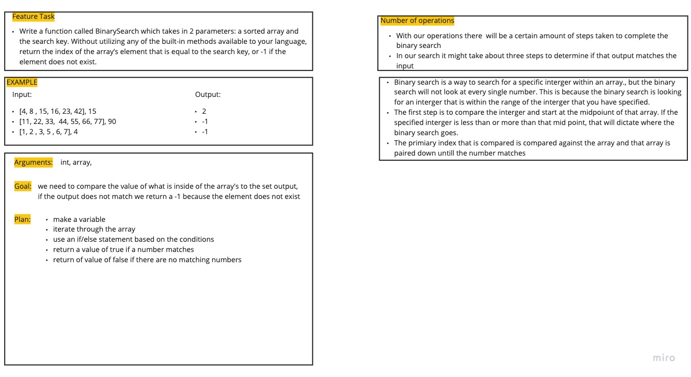

# Challenge Summary

- The challenge is to search through a set of arrays and compare it against a given value

## Challenge Description

- Write a function called BinarySearch which takes in 2 parameters: a sorted array and the search key. Without utilizing any of the built-in methods available to your language, return the index of the array’s element that is equal to the search key, or -1 if the element does not exist.

## Approach & Efficiency

- My approach is to use a if/else statment to set a specific set of conditions for the function and that way I can create a comparision operator

## Solution 

